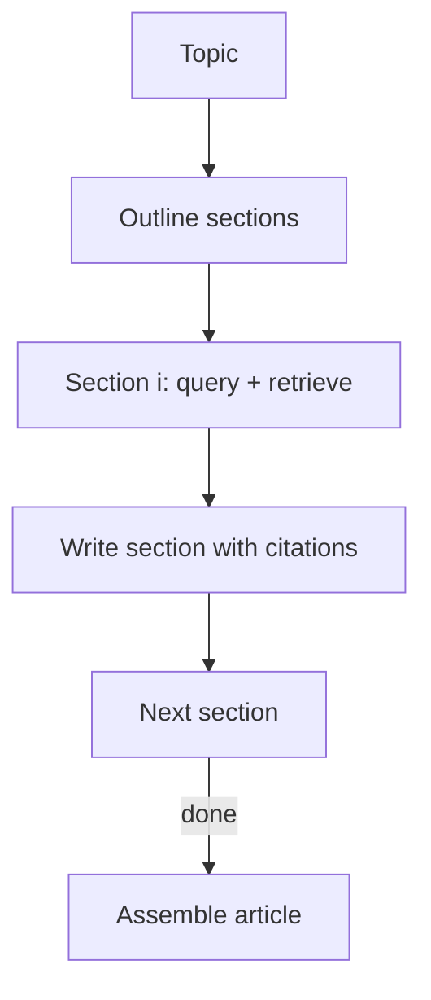

# STORM（研究写作：分段检索 + 组装）

## 解决的问题

研究写作不是一次 query：你需要先有结构，再逐段补证据，然后组装。

- 先 outline
- 每节独立检索证据
- 每节写作要落地到证据
- 最后 assemble

## 核心流程

## 演化路径

- 基于 Retrieval Loop 家族
- 可与 Agentic RAG 结合（每节动态决定检索次数）

## 本仓库对应

- 代码：`src/agent_patterns_lab/patterns/storm.py`
- 示例：`examples/56_storm.py`
- 测试：`tests/test_storm.py`

