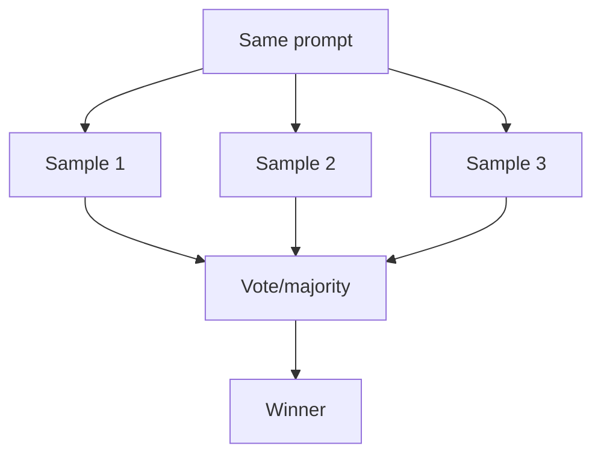

# Voting / Self-Consistency（自洽投票）

## 解决的问题

模型具有随机性。Voting 通过采样多次并投票，降低方差、提升鲁棒性。

## 什么时候用

- 答案较短且容易做 normalize
- 任务足够便宜，能采样 N 次
- 更看重稳健性而非极致延迟

## 核心流程

## 演化路径

- 常与 Maker-Checker / CoVe 搭配
- 上线时用 eval 控制成本与回归

## 本仓库对应

- 代码：`src/agent_patterns_lab/patterns/voting.py`
- 示例：`examples/31_voting.py`
- 测试：`tests/test_voting.py`

