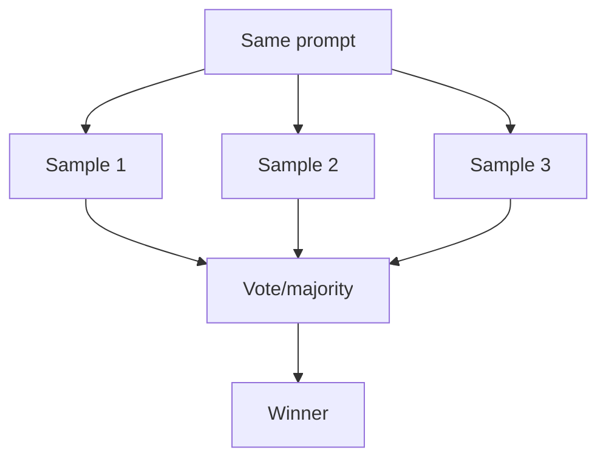

# Voting / Self-Consistency（自洽投票）

## 解决的问题

模型具有随机性。Voting 通过采样多次并投票，降低方差、提升鲁棒性。

## 什么时候用

- 答案较短且容易做 normalize
- 任务足够便宜，能采样 N 次
- 更看重稳健性而非极致延迟

## 什么时候别用

- 任务需要**外部真相**（最新事实、工具观测）→ 先加检索/验证，不要只加采样。
- 你没法 normalize（长文无“答案键”）→ 更适合 Maker-Checker。
- 你已经预算紧张 → voting 天生是“成本倍增器”。

## 核心流程



## 它是如何运作的

Voting 利用多次采样带来的“多样性”：

1. 对同一输入生成 `N` 个候选（常用更高 temperature）。
2. 尽可能把输出做 **normalize**（抽取最终答案、解析 JSON 等）。
3. 用以下方式选出赢家：
   - 对 normalize 后完全一致的答案做多数投票
   - 用单独的 judge / rubric 对候选打分
   - 做 pairwise 淘汰赛（A vs B vs C…）

### 机制细节（提前定好，别临场拍脑袋）

- **投票对象**：是最终答案字符串？解析后的 JSON？还是某个派生 key（比如 route id）？
- **normalize 方法**：能严格解析就别用正则；不要对原始长文直接投票。
- **平票处理**：judge rubric、选“更易验证”的候选、或回退到 checker。
- **何时花票**：先路由，只把难样本送去 voting；简单样本保持 single-shot。

## 一个能对照的例子

```bash
UV_CACHE_DIR=.uv_cache PYTHONPATH=src uv run --no-sync python examples/31_voting.py
```

## 常见失败模式与对策

- **没有明显多数**：引入 judge rubric；增大 N；或回退到 maker-checker。
- **系统性偏差**（全都错）：需要检索/验证，而不是继续投票。
- **难以 normalize**：强制 structured output；对派生指标投票。
- **成本太高**：只对难样本启用 voting（先路由过滤简单样本）。

## 演化路径

- 常与 Maker-Checker / CoVe 搭配
- 上线时用 eval 控制成本与回归

## 本仓库对应

- 代码： [`src/agent_patterns_lab/patterns/voting.py`](https://github.com/lifeodyssey/agent-patterns-lab/blob/main/src/agent_patterns_lab/patterns/voting.py)
- 示例： [`examples/31_voting.py`](https://github.com/lifeodyssey/agent-patterns-lab/blob/main/examples/31_voting.py)
- 测试： [`tests/test_voting.py`](https://github.com/lifeodyssey/agent-patterns-lab/blob/main/tests/test_voting.py)

## 参考资料

- Wang 等（2022）：Self-Consistency（多条推理路径采样→选最一致答案）https://arxiv.org/abs/2203.11171
