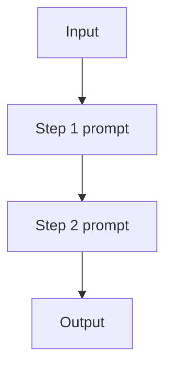

# Prompt Chaining（工作流）

## 解决的问题

单个 prompt 往往混杂多个步骤（抽取→改写→格式化），错误率更高。  
Prompt chaining 把控制流变成**显式步骤**：每一步只做一件事。

## 什么时候用

- 步骤提前已知，基本不需要“边做边改流程”。
- 希望拿到中间产物，方便调试与验收。
- 不需要在中途插入工具观测（否则更像 agent loop）。

## 核心流程

## 它是如何运作的

Prompt chaining 本质上是把“隐式多步骤 prompt”拆成显式流水线：

1. 定义清晰的 **step 边界**（每一步只负责一件事）。
2. 设计 step 间的 **接口**（纯文本也行，但更推荐结构化 JSON）。
3. 按顺序执行各 step，并把中间产物记录下来（便于复盘/回归）。
4. 在边界处做 **校验**（schema 检查、约束、guardrails）。

好处是：每一步更简单，错误更局部，调试成本更低。

## 常见失败模式与对策

- **错误传播**（上游错 → 下游全错）：尽早校验；每一步加修复重试。
- **过度拆分**（step 太多）：合并直到“每一步都带来明确收益”。
- **接口脆弱**（格式漂移）：使用 structured output + 严格解析。
- **成本/延迟过高**：缓存中间结果；能跳过的 step 直接 short-circuit。

## 变体

- **扇出/扇入**：某一步生成多个候选，下游选择/合并。
- **分支工作流**：加 routing，根据输入选择不同链路。

## 演化路径

- 来源：Single-shot prompting
- 常见组合：Structured output（让 step 输出可校验）、Routing（选择不同链路）
- 若需要环境反馈：升级为 ReAct agent loop

## 本仓库对应

- 代码： [`src/agent_patterns_lab/patterns/workflow_chaining.py`](https://github.com/lifeodyssey/agent-patterns-lab/blob/main/src/agent_patterns_lab/patterns/workflow_chaining.py)
- 示例： [`examples/11_prompt_chaining.py`](https://github.com/lifeodyssey/agent-patterns-lab/blob/main/examples/11_prompt_chaining.py)
- 测试： [`tests/test_workflow_chaining.py`](https://github.com/lifeodyssey/agent-patterns-lab/blob/main/tests/test_workflow_chaining.py)
