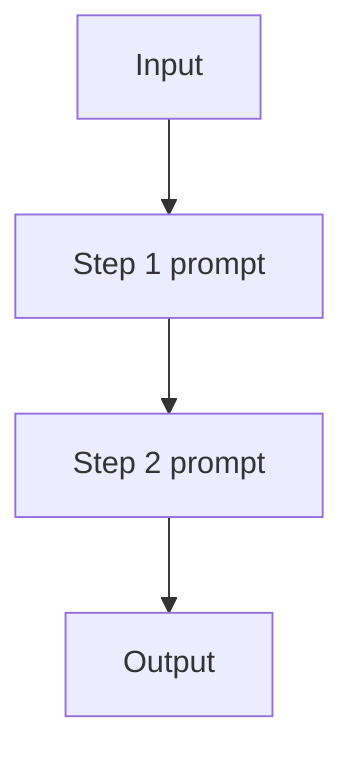

# Prompt Chaining（工作流）

## 一句话（TL;DR）

Prompt chaining 是一个**固定工作流**：把一个“糊在一起的大 prompt”拆成一串更小的步骤，并把步骤间的输入输出讲清楚。

## 你大概率需要它（症状）

- 你能把步骤提前列出来。
- 你想看到中间产物，方便调试/验收/回归。
- 你不需要依赖工具观测来决定下一步（否则更像 agent loop）。

## 解决的问题

单个 prompt 往往混杂多个步骤（抽取→改写→格式化），错误率更高。  
Prompt chaining 把控制流变成**显式步骤**：每一步只做一件事。

## 什么时候用

- 步骤提前已知，基本不需要“边做边改流程”。
- 希望拿到中间产物，方便调试与验收。
- 不需要在中途插入工具观测（否则更像 agent loop）。

## 什么时候别用

- 下一步依赖**观测**（工具输出）且你事先预料不到 → 用 **ReAct / agent loop**。
- 你其实只有一个模糊步骤（“写一句回复就行”）→ chaining 只会增加延迟。
- 你对延迟极敏感 → 尽量减少模型调用（合并 step，或用更小模型跑早期 step）。

## 核心流程



## 手工走一遍（两步流水线）

把它当成一个很小的 pipeline：

1. Step 1 产出一个中间产物（比如抽取要点）。
2. Step 2 消费这个中间产物，产出最终输出（比如格式化后的回答）。

如果你说不清中间产物是什么，这条 chain 往往就没带来多少收益。

## 它是如何运作的

Prompt chaining 本质上是把“隐式多步骤 prompt”拆成显式流水线：

1. 定义清晰的 **step 边界**（每一步只负责一件事）。
2. 设计 step 间的 **接口**（纯文本也行，但更推荐结构化 JSON）。
3. 按顺序执行各 step，并把中间产物记录下来（便于复盘/回归）。
4. 在边界处做 **校验**（schema 检查、约束、guardrails）。

好处是：每一步更简单，错误更局部，调试成本更低。

### 机制细节（最好显式化）

- **契约**：每个 step 输出长什么样（schema/格式）要写死，不靠“差不多”。
- **状态传递**：决定哪些信息往下传（全量上下文 vs 摘要 vs 结构化字段）。
- **停机条件**：允许 short-circuit（比如 step2 判定“已经满足”，就跳过 step3）。
- **缓存**：把稳定步骤（分类/抽取）缓存起来，避免同一输入重复付费。

## 一个能对照的例子

```bash
UV_CACHE_DIR=.uv_cache PYTHONPATH=src uv run --no-sync python examples/11_prompt_chaining.py
```

??? example "示例代码（`examples/11_prompt_chaining.py`）"
    ```python
    --8<-- "examples/11_prompt_chaining.py"
    ```

## 常见失败模式与对策

- **错误传播**（上游错 → 下游全错）：尽早校验；每一步加修复重试。
- **过度拆分**（step 太多）：合并直到“每一步都带来明确收益”。
- **接口脆弱**（格式漂移）：使用 structured output + 严格解析。
- **成本/延迟过高**：缓存中间结果；能跳过的 step 直接 short-circuit。

## 变体

- **扇出/扇入**：某一步生成多个候选，下游选择/合并。
- **分支工作流**：加 routing，根据输入选择不同链路。

## 演化路径

- 来源：Single-shot prompting
- 常见组合：Structured output（让 step 输出可校验）、Routing（选择不同链路）
- 若需要环境反馈：升级为 ReAct agent loop

## 本仓库对应

- 代码： [`src/agent_patterns_lab/patterns/workflow_chaining.py`](https://github.com/lifeodyssey/agent-patterns-lab/blob/main/src/agent_patterns_lab/patterns/workflow_chaining.py)
- 示例： [`examples/11_prompt_chaining.py`](https://github.com/lifeodyssey/agent-patterns-lab/blob/main/examples/11_prompt_chaining.py)
- 测试： [`tests/test_workflow_chaining.py`](https://github.com/lifeodyssey/agent-patterns-lab/blob/main/tests/test_workflow_chaining.py)

## 参考资料

- Azure Architecture Center — AI agent orchestration patterns（Sequential orchestration）：https://learn.microsoft.com/en-us/azure/architecture/ai-ml/guide/ai-agent-design-patterns
- Microsoft Agent Framework — Sequential orchestration：https://learn.microsoft.com/en-us/agent-framework/user-guide/workflows/orchestrations/sequential
