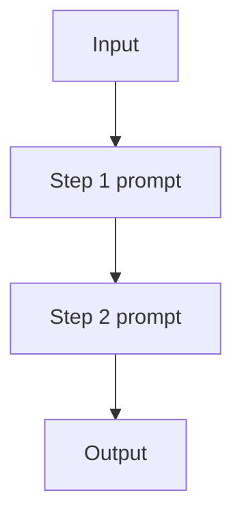

# Prompt Chaining（工作流）

## 解决的问题

单个 prompt 往往混杂多个步骤（抽取→改写→格式化），错误率更高。  
Prompt chaining 把控制流变成**显式步骤**：每一步只做一件事。

## 什么时候用

- 步骤提前已知，基本不需要“边做边改流程”。
- 希望拿到中间产物，方便调试与验收。
- 不需要在中途插入工具观测（否则更像 agent loop）。

## 核心流程

## 演化路径

- 来源：Single-shot prompting
- 常见组合：Structured output（让 step 输出可校验）、Routing（选择不同链路）
- 若需要环境反馈：升级为 ReAct agent loop

## 本仓库对应

- 代码：`src/agent_patterns_lab/patterns/workflow_chaining.py`
- 示例：`examples/11_prompt_chaining.py`
- 测试：`tests/test_workflow_chaining.py`

