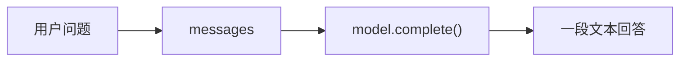

# 00：最小 Chatbot

先不要谈 Agent。最小形态就是一个 Chatbot：给模型一段消息，拿回一段文本。

这一步很朴素，但别跳过。
很多 Agent 系统最后会变复杂，是因为最小 Chatbot 开始暴露问题：
它会忘、会编、不会查资料，也不会自己决定下一步做什么。

## 解决的问题

最小 Chatbot 解决的是“把自然语言请求交给模型”这件事。

## 它是如何运作的

你有一个用户问题，比如：

> 帮我规划一个杭州一日游。

你把它包成 message，交给模型，模型返回一段回答。没有工具，没有记忆，没有循环。



这就是起点。

## 一个能跑的最小例子

```python
--8<-- "examples/00_single_shot.py"
```

运行：

```bash
uv run python examples/00_single_shot.py
```

## 这段代码做了什么

它只有三件事：

1. 准备一条用户消息：请它规划杭州一日游。
2. 调用 `model.complete(messages)`。
3. 打印模型返回的文本。

这就是最小 Chatbot。

## 什么时候够用

如果任务本来就是“一问一答”，这个版本就够了：

- 解释一个概念。
- 改写一段文案。
- 根据用户给出的材料做总结。
- 生成一个不需要实时信息的小草稿。

它的好处是简单。简单到你能看清每一行代码。

## 什么时候不够

这个版本看起来已经会回答，但它有几个根本问题：

- 它不知道实时天气。
- 它不知道景点开放时间。
- 它没有结构化输出，前端不好渲染。
- 它不能可靠地记住你前面说过什么。
- 它的回答无法复盘：你不知道它为什么这样安排。

这也是整条演化路线的开头：不是突然“上 Agent”，而是先看最小 Chatbot 哪里开始撑不住。

## 常见失败模式

- 用户问“今天西湖下雨吗”，它可能直接编一个天气。
- 用户上一轮说“预算 300 元”，下一轮它可能忘掉。
- 前端想要景点、时间、交通方式三个字段，它却返回一整段散文。
- 你想知道它为什么安排灵隐寺在下午，它给不出可复盘的过程。

每一个失败，后面都会长出一个模式。
记不住，就加 conversation history。
输出不稳定，就加 structured output。
需要查资料，就加 tool calling。
需要多步判断，就进入 agent loop。

## 下一步

先解决第一个小问题：Chatbot 怎么记住当前对话？看 [01：对话历史](01_conversation.md)。

## 附录：真实 LLM API 长什么样

上面的例子用的是 `MockLLM`。这不是为了装样子。
这里有一个很实在的麻烦：
你的代码只想问一句话、拿一段回复，但每家模型 API 都有自己的脾气。

所以我们先把边界切出来：

```python
class Model(Protocol):
    def complete(self, messages: Sequence[Message], *, tracer: Tracer | None = None) -> str: ...
```

教程里的模式代码只依赖这个接口。
`MockLLM`、`OpenAIChatModel`、`AnthropicMessagesModel` 都可以塞进来。
以后要接 Gemini 或 DeepSeek，也应该写新的 adapter，
而不是去改 chatbot、workflow 或 agent loop。

### 几种常见 API 形状

| Provider | 请求长什么样 | 返回文本通常从哪里取 | 官方文档 |
|---|---|---|---|
| OpenAI Responses API | `POST /v1/responses`，常见字段是 `model` 和 `input`。它是 OpenAI 现在更通用的接口，也放进了内置工具、状态和函数调用。 | SDK 里通常读 `response.output_text`；底层对象也可能是分块的 `output`。 | [Responses API](https://platform.openai.com/docs/api-reference/responses/create?api-mode=responses) |
| OpenAI Chat Completions API | `POST /v1/chat/completions`，主要字段是 `messages=[{"role": "...", "content": "..."}]`。很多第三方服务也兼容这个形状。 | `choices[0].message.content`。 | [Chat Completions API](https://platform.openai.com/docs/api-reference/chat/create) |
| Anthropic Messages API | `POST /v1/messages`。`system` 是顶层字段，不是普通 message；`messages` 主要是 `user` / `assistant` 轮次。 | `content` 里的 text block，比如 `message.content[0].text`。 | [Messages API](https://docs.anthropic.com/en/api/messages) |
| Google Gemini API | 常见调用是 `models.generateContent`，输入字段叫 `contents`，里面可以放文本、多模态 part。 | SDK 里通常读 `response.text`；复杂场景看 `candidates`。 | [generateContent](https://ai.google.dev/api/generate-content) |
| DeepSeek API | 有自己的官方文档，但 chat 接口接近 OpenAI Chat Completions：`messages`、`model`、`temperature`、`tools` 这些字段都很熟。 | `choices[0].message.content`。 | [DeepSeek Chat Completion](https://api-docs.deepseek.com/api/create-chat-completion) |

看出问题了吗？
大家都叫“chat”，但消息格式、system prompt 的位置、返回文本的位置并不一样。
把这些差异散落在业务代码里，后面会很痛苦。

### Provider 应该负责什么

在这个项目里，provider 只是薄薄的一层胶水。

它做四件事：

1. 把我们的 `Message` 转成某家 API 要的 payload。
2. 调 SDK 或 HTTP API。
3. 从返回对象里抽出最终文本。
4. 顺手写 trace，方便复盘。

模式代码不该知道 `choices[0].message.content`。它只需要这样写：

```python
answer = model.complete([
    Message(role="user", content="帮我规划一个杭州一日游。")
])
```

换模型时，换的是 `model`：

```python
model = MockLLM(["先去西湖，再去灵隐寺。"])

model = OpenAIChatModel(model=os.environ["OPENAI_MODEL"])

model = AnthropicMessagesModel(model=os.environ["ANTHROPIC_MODEL"])

model = OpenAIChatModel(
    model="deepseek-chat",
    api_key=os.environ["DEEPSEEK_API_KEY"],
    base_url="https://api.deepseek.com",
)
```

如果以后要接 OpenAI Responses API，可以加一个 `OpenAIResponsesModel`。
如果要接 Gemini，可以加一个 `GeminiModel`。
它们都实现同一个 `Model.complete()`。

### 那 Vercel AI SDK、Pydantic AI、LangChain 在做什么

我查了一圈，它们在 provider 这件事上的想法其实很接近，只是厚度不同。

| 框架 | 它怎么抽象 provider | 对我们的启发 |
|---|---|---|
| [Vercel AI SDK](https://ai-sdk.dev/docs/foundations/providers-and-models) | 用统一的 language model specification 包住不同 provider。你在应用里传的是 `openai("...")` 这种 model object，而不是手写各家 HTTP 格式。 | provider 可以像一个可替换的模型对象。这个思路很好，但它主要服务 JS/TS 前端和 streaming UI。 |
| [Pydantic AI](https://ai.pydantic.dev/models/overview/) | 区分 `Model` 和 provider。文档里也明确说，模型类包住 vendor SDK，让同一个 Agent 可以换供应商。它还提供 `TestModel` / `FunctionModel`。 | 很适合我们：离线 mock、真实 SDK、结构化输出，都可以放在同一个接口后面。 |
| [LangChain](https://docs.langchain.com/oss/python/integrations/chat) | 用标准 ChatModel 接口和大量 integration package 覆盖 provider。生态很全，也很重。 | 做产品时省事；做教学时容易遮住细节。我们可以学它的接口统一，不必把整套框架搬进来。 |

所以这个教程的选择是：默认用 `MockLLM`，因为它可复现。
需要真实模型时，用薄 adapter 接 OpenAI / Anthropic / DeepSeek。
先不要引入 LangChain 这类大框架。
我们不是反对它们，只是不想在第一章就把读者带进抽象迷雾里。
